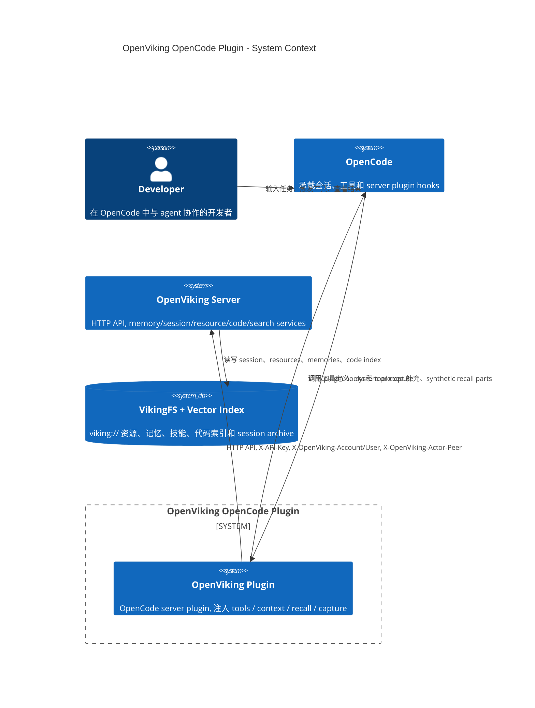
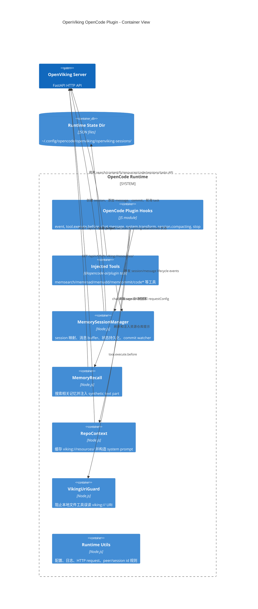
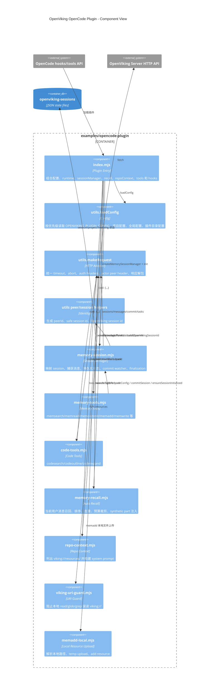
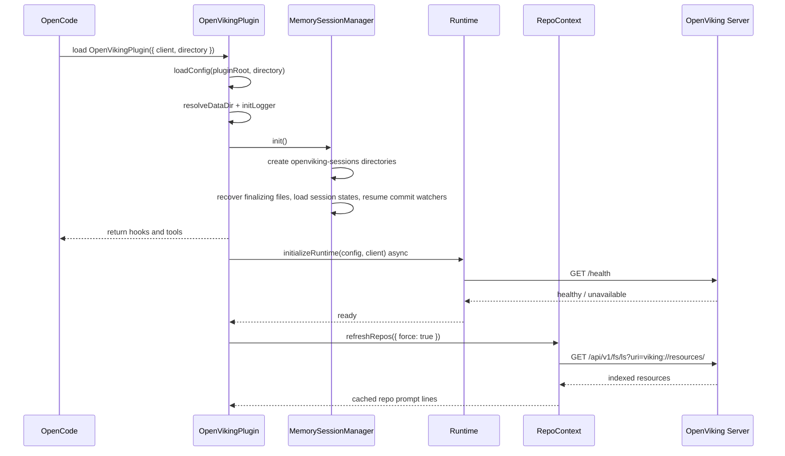
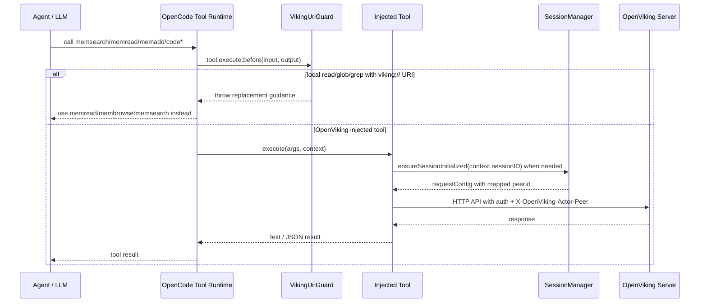
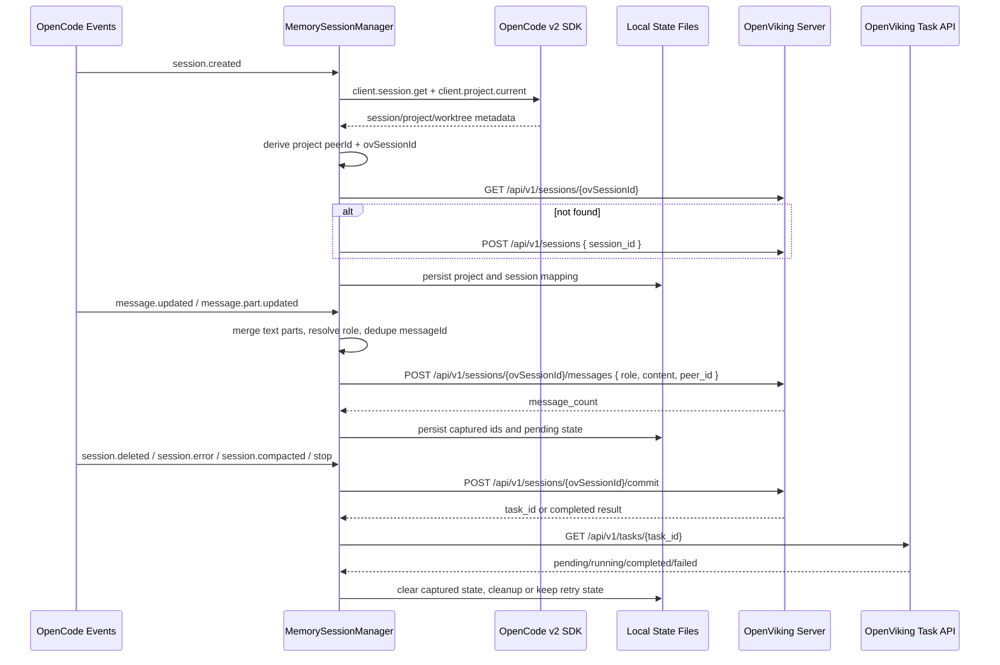
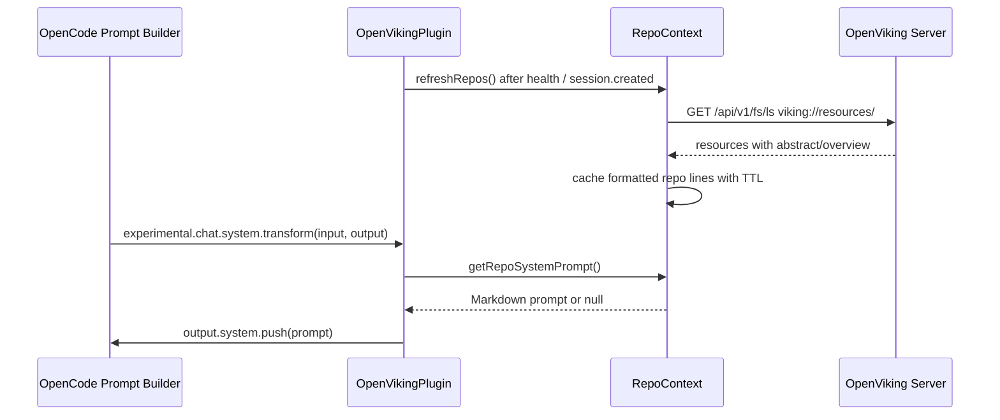
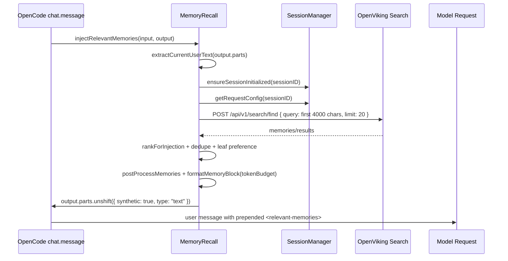

# OpenViking OpenCode Plugin Architecture

## 文档目标

本文面向 OpenViking 和 OpenCode 插件开发者，说明 `examples/opencode-plugin` 的架构、运行路径、边界约束和可改进点。文档主线是 OpenCode 插件自身，`examples/openclaw-plugin` / Claude Code 插件仅作为功能对比，用于评估 tools、系统上下文注入、消息召回和采集机制的差异。

## 代码范围

主要分析对象如下。

- `examples/opencode-plugin/index.mjs`：OpenCode 插件入口，注册 hooks、tools 和生命周期处理。
- `examples/opencode-plugin/lib/utils.mjs`：配置加载、日志、HTTP 请求、peerId 和 sessionId 生成规则。
- `examples/opencode-plugin/lib/memory-session.mjs`：OpenCode session 到 OpenViking session 的映射、消息采集、提交和本地状态持久化。
- `examples/opencode-plugin/lib/memory-tools.mjs`：`mem*` 工具注入和 OpenViking HTTP API 适配。
- `examples/opencode-plugin/lib/code-tools.mjs`：`code*` 结构化代码检索工具注入。
- `examples/opencode-plugin/lib/memory-recall.mjs`：自动消息召回和 synthetic context 注入。
- `examples/opencode-plugin/lib/repo-context.mjs`：已索引资源仓库的系统提示注入。
- `examples/opencode-plugin/lib/viking-uri-guard.mjs`：阻止本地文件工具误读 `viking://` URI。
- `examples/opencode-plugin/lib/memadd-local.mjs`：本地文件资源上传和 `memadd` 双阶段导入。

对比对象如下。

- `examples/openclaw-plugin/index.ts`：OpenClaw / Claude Code 风格插件入口，集中注册 context engine、tools、commands、routes、services 和 hooks。
- `examples/openclaw-plugin/context-engine.ts`：context engine 的 `assemble`、`afterTurn`、`compact`、`commitOVSession` 标准接口。
- `examples/openclaw-plugin/auto-recall.ts`：更复杂的自动召回策略、trace 和预算控制。
- `examples/openclaw-plugin/plugin/openviking-*.ts`：OpenClaw 插件中的工具注册、生命周期 hook、查询工具、memory recall 工具和 trace 工具。

## 功能用例列表

| 用例 | 入口 | 主要代码 | OpenViking API | 结果 |
| --- | --- | --- | --- | --- |
| 搜索长期记忆、资源和技能 | `memsearch` | `memory-tools.mjs` | `POST /api/v1/search/find` 或 `POST /api/v1/search/search` | 返回 memories/resources/skills 的语义检索结果 |
| 读取 OpenViking URI | `memread` | `memory-tools.mjs` | `GET /api/v1/content/{level}` | 按 `abstract`、`overview`、`read` 或 `auto` 读取内容 |
| 浏览虚拟文件系统 | `membrowse` | `memory-tools.mjs` | `GET /api/v1/fs/ls`、`tree`、`stat` | 发现精确 URI、目录和元数据 |
| 精确文本搜索 | `memgrep` | `memory-tools.mjs` | `POST /api/v1/search/grep` | 在 OpenViking 内容中搜索符号、错误串、关键词 |
| Glob 枚举文件 | `memglob` | `memory-tools.mjs` | `POST /api/v1/search/glob` | 按 glob 返回候选 URI |
| 添加资源 | `memadd` | `memory-tools.mjs`、`memadd-local.mjs` | `POST /api/v1/resources/temp_upload`、`POST /api/v1/resources` | 导入远程 URL 或本地文件，并返回 observer queue |
| 写入虚拟文件 | `memwrite` | `memory-tools.mjs` | `POST /api/v1/content/write` | 创建、追加或替换 `viking://` 文件内容 |
| 删除资源 | `memremove` | `memory-tools.mjs` | `DELETE /api/v1/fs` | 显式确认后删除 URI |
| 查看队列 | `memqueue` | `memory-tools.mjs` | `GET /api/v1/observer/queue` | 查看 embedding 和语义处理状态 |
| 提交会话 | `memcommit`、生命周期 hook | `memory-session.mjs` | `POST /api/v1/sessions/{id}/commit`、`GET /api/v1/tasks/{id}` | 归档会话并触发记忆抽取 |
| 自动采集消息 | OpenCode event hook | `memory-session.mjs` | `POST /api/v1/sessions/{id}/messages` | 捕获 user / assistant 文本到 OpenViking session |
| 自动召回消息 | `chat.message` hook | `memory-recall.mjs` | `POST /api/v1/search/find` | 把相关记忆作为 synthetic text part 插入当前用户消息 |
| 注入资源索引提示 | `experimental.chat.system.transform` hook | `repo-context.mjs` | `GET /api/v1/fs/ls?uri=viking://resources/` | 在 system prompt 中列出已索引仓库和工具使用建议 |
| 保护虚拟 URI | `tool.execute.before` hook | `viking-uri-guard.mjs` | 无 | 阻止本地 `read/glob/grep` 误处理 `viking://` |
| 代码符号检索 | `codesearch`、`codeoutline`、`codeexpand` | `code-tools.mjs` | `POST /api/v1/code/search`、`outline`、`expand` | 对已索引代码仓库做 AST 级 symbol 检索 |

## 整体架构

OpenCode 插件是一个运行在 OpenCode server 插件面上的轻量适配层。它不启动 OpenViking，也不通过 shell 调用 `ov` CLI，而是通过 HTTP API 访问已运行的 OpenViking Server。插件承担四类职责：把 OpenViking 能力注入为 OpenCode tools、把已索引资源注入 system prompt、把 OpenCode 消息采集到 OpenViking session、在用户消息进入模型前召回相关记忆。

插件入口 `OpenVikingPlugin({ client, directory })` 完成初始化。它从配置文件和环境变量合并配置，创建 runtime data dir 和日志文件，初始化 `MemorySessionManager`，然后返回 OpenCode hooks。OpenViking Server 的连接信息由 `endpoint`、`apiKey`、`account`、`user` 和 `peerId` 控制。

### C4 Context



### C4 Container



### 关键架构边界

OpenCode 插件只负责桥接和策略。OpenViking Server 负责实际存储、检索、索引、归档和记忆抽取。插件不直接访问 VikingFS 或向量索引，只通过 HTTP API 交互。

会话身份由插件本地映射负责。OpenCode session id 不直接等同于 OpenViking session id，插件会生成可读、稳定、长度受控的 `ovSessionId`，并用 `peerId` 将项目级上下文绑定到 OpenViking 的 actor peer 视图。

OpenCode 的本地 filesystem tools 不能读 `viking://` URI。插件通过 `tool.execute.before` 主动拦截 `read`、`glob`、`grep` 中的 `viking://` 参数，避免 agent 把虚拟 URI 当成本地路径。

## 内部组件交互图



## 系统交互图

### 插件启动与系统上下文预热



### Tool 调用路径



### 消息采集与会话提交路径



## 注入 Tools 详解

OpenCode 插件通过返回对象中的 `tool: { ...tools, ...codeTools }` 注入工具。工具实现统一使用 `@opencode-ai/plugin` 的 `tool()` 声明参数 schema，并通过 `context.sessionID` 获取当前 OpenCode session。需要 session-aware 行为的工具会先调用 `sessionManager.ensureSessionInitialized(context.sessionID)`，再用 `sessionManager.getRequestConfig()` 获得包含当前 peerId 的请求配置。

### Memory 和 Resource Tools

| Tool | 设计目的 | API | 关键行为 |
| --- | --- | --- | --- |
| `memsearch` | 语义搜索 memories/resources/skills | `POST /api/v1/search/find` 或 `/search/search` | `mode=deep` 且有 session 时传 `session_id`，否则按查询复杂度自动选择 fast/deep |
| `memread` | 读取一个 `viking://` URI | `GET /api/v1/content/{level}` | `level=auto` 先 stat，目录走 `overview`，文件走 `read` |
| `membrowse` | 查看目录、树或 stat | `GET /api/v1/fs/ls`、`tree`、`stat` | 用于发现精确 URI，避免把目录当文件读 |
| `memcommit` | 立即提交当前或指定 OpenViking session | `POST /api/v1/sessions/{id}/commit`、`GET /api/v1/tasks/{id}` | 不传 `session_id` 时使用当前 OpenCode session 映射；显式 `session_id` 不创建本地 OpenCode mapping |
| `memgrep` | exact / regex-like 文本搜索 | `POST /api/v1/search/grep` | 默认从 `viking://resources/` 开始，可指定 `exclude_uri` 和 `level_limit` |
| `memglob` | glob 枚举文件 | `POST /api/v1/search/glob` | 默认从 `viking://resources/` 开始，返回候选 URI |
| `memadd` | 导入远程 URL 或本地文件 | `POST /api/v1/resources/temp_upload`、`POST /api/v1/resources` | 本地文件走 temp upload；远程 URL 直接 add；目录暂不支持 |
| `memwrite` | 写入虚拟文件 | `POST /api/v1/content/write` | 默认 `mode=create`，避免误覆盖；支持 `append` 和 `replace` |
| `memremove` | 删除 `viking://` URI | `DELETE /api/v1/fs` | 必须 `confirm=true`；工具描述要求先获得用户明确确认 |
| `memqueue` | 查看索引队列状态 | `GET /api/v1/observer/queue` | 常用于 `memadd` 后确认 embedding / semantic processing 进度 |

`memsearch` 的模式选择是一个小型策略层。显式 `fast` 使用 `/find`，显式 `deep` 使用 `/search`。未指定时，如果当前存在 OpenViking session，或者 query 看起来是长问题、问句、8 个词以上的复杂查询，则倾向 `deep`；短关键词搜索倾向 `fast`。

`memadd` 的本地文件处理是插件侧少数直接访问本地文件系统的逻辑。`resolveMemaddSource()` 会把相对路径解析到 OpenCode 项目目录，校验存在且是文件，再由 `uploadLocalResource()` 读 bytes 并用 `FormData` 上传到 `/api/v1/resources/temp_upload`。随后 `addMemaddResource()` 用返回的 `temp_file_id` 调用 `/api/v1/resources`。这避免让 OpenViking HTTP server 直接读取 agent 所在机器的任意路径。

### Code Tools

| Tool | 设计目的 | API | 使用约束 |
| --- | --- | --- | --- |
| `codesearch` | 在已确认代码仓库内按 symbol 名检索 | `POST /api/v1/code/search` | 只适合 AST 支持的源码仓库，不用于普通文本和记忆搜索 |
| `codeoutline` | 展示一个源码文件的 symbol 结构 | `POST /api/v1/code/outline` | 必须传确切源码文件 URI，不用于目录或文档 |
| `codeexpand` | 展开一个已确认 symbol 的源码 | `POST /api/v1/code/expand` | 需要先由 `codeoutline` 或其他证据确认 symbol 存在 |

Code tools 和 memory tools 使用相同的 `makeRequest()`，因此都会带上 `X-API-Key`、`X-OpenViking-Account`、`X-OpenViking-User` 和有效的 `X-OpenViking-Actor-Peer`。这保证代码检索也受当前 actor peer 视图影响。

### Tool 注入安全边界

插件没有通过 `tool.definition` 动态改写 OpenCode 内置工具，而是直接新增 OpenViking tools，同时用 `tool.execute.before` 在执行前拦截本地文件工具。这个策略的好处是与 OpenCode 原生 tool registry 解耦，风险面较小；不足是无法改变模型对原生 `read/glob/grep` 的选择倾向，只能在误用时失败并提示替代工具。

`viking-uri-guard.mjs` 只拦截 `read`、`glob`、`grep` 三个本地工具名，并扫描 `filePath`、`path`、`uri` 参数。它不拦截 shell、bash 或其他可能间接处理 URI 的工具，因此文档和系统提示仍需要明确告知 agent：`viking://` 是虚拟路径，不是本地路径。

## 采集上报机制详解

OpenCode 插件通过 `event` hook 接收 session 和 message 事件。当前实现处理 `session.created`、`session.deleted`、`session.error`、`session.compacted`、`message.updated`、`message.part.updated`，忽略高频 `session.diff`。

### Session 映射和 peerId

插件本地维护 `OpenCode session id -> OpenViking session id` 的映射。映射里包含 `openCodeSessionId`、`safeOpenCodeSessionId`、`projectID`、`safeProjectId`、`peerId`、`ovSessionId`、capture 状态和 commit 状态。

peerId 有两种模式。

| 模式 | 来源 | 行为 |
| --- | --- | --- |
| `fixed` | `config.peerId` 或 `OPENVIKING_PEER_ID` | 必须是合法 peerId；无效时禁用 peer 传播 |
| `auto` | OpenCode v2 `client.session.get()`、`client.project.current()`、session directory/worktree basename | 优先复用项目状态文件里的 peerId；没有时按 `worktree basename + project id prefix` 派生 |

`auto` 模式刻意不 fallback 到插件初始化目录。插件无法可靠判断自身是随 OpenCode server 实例化还是随每个项目实例化，使用插件目录会把多个 workspace/worktree 错误合并到同一个 peer。当前实现改用 OpenCode session/project API 和 session-bound directory/worktree 来派生项目身份。

OpenViking session id 由 `buildOpenVikingSessionId()` 生成。若有有效 peerId，前缀为 `${peerId}_`；否则使用 `opencode_`。后缀来自规范化后的 OpenCode session id，并受 `MAX_OV_SESSION_ID_LENGTH=512` 限制。

### 本地状态目录

默认状态目录是 `~/.config/opencode/openviking/openviking-sessions/`。目录结构如下。

```text
openviking-sessions/
├── meta.json
├── projects/
│   └── <safeProjectId>.json
├── sessions/
│   └── <safeOpenCodeSessionId>.json
├── finalizing/
│   └── <safeOpenCodeSessionId>.<pid>.<time>.json
└── abandoned/
    └── <bad-or-conflict-state>.<time>.json
```

`projects/` 保存项目级 peerId，保证同一项目在不同 session 中复用可读且稳定的 peer。`sessions/` 保存活跃 session 的消息采集进度和 commit 状态。`finalizing/` 用于跨进程或异常退出的最终提交声明，避免一个 session 在 cleanup 过程中被重复处理。`abandoned/` 保存坏 JSON、冲突状态或无法安全恢复的文件，避免直接删除诊断信息。

旧版本的 `openviking-session-map.json` 会被重命名为 `openviking-session-map.v1-backup-*.json`，当前代码不迁移旧 map 内容。这是明确选择：新的 split state 包含 project/session/finalizing 多类状态，直接迁移旧单文件 map 容易引入不完整语义。

### 消息采集和去重

OpenCode 的消息事件是分阶段到达的。`message.updated` 提供 message id、role 和 finish 状态，`message.part.updated` 提供 text part 内容。插件需要把 role 和 text 分开收集，再等两者都齐全后上报。

采集规则如下。

- `user` 消息在 `message.updated` 时记录 role。
- `assistant` 消息只有 `finish === "stop"` 时记录 role，避免采集中间流式片段。
- 只采集 `part.type === "text"` 且非空的 text part。
- `pendingMessages` 保存还未成功上报的 messageId 到内容映射。
- `capturedMessages` 保存已成功上报的 messageId，避免重复添加。
- `mergeMessageContent()` 处理流式文本增量、重复片段、包含关系和非连续片段。

如果消息事件早于 `session.created` 到达，插件会先写入内存 buffer。`ensureSessionInitialized()` 会尝试懒初始化 session mapping，成功后再把 buffered message 应用到 mapping 并 flush。buffer 有数量和 TTL 限制，避免孤儿事件无限占用内存。

### 上报到 OpenViking session

当 role 和 content 都准备好后，`flushPendingMessages()` 调用 `addMessageToSession()`。

```json
{
  "role": "user | assistant",
  "content": "message text",
  "peer_id": "optional project peer id"
}
```

请求路径是 `POST /api/v1/sessions/{ovSessionId}/messages`。插件同时在 header 里带 `X-OpenViking-Actor-Peer`。服务端 `AddMessageRequest.peer_id` 会被校验和规范化；消息体里的 `peer_id` 优先作为消息 peer，legacy `X-OpenViking-Agent` 只在 assistant 消息上作为兼容 fallback。当前插件不发送 legacy agent header。

### Commit 和最终化

插件会在以下边界触发 commit。

- 用户显式调用 `memcommit`。
- OpenCode `session.deleted`。
- OpenCode `session.error`。
- OpenCode `session.compacted`。
- OpenCode `experimental.session.compacting`。
- 插件 `stop`。
- 本地 session 状态过期或带 `pendingCleanup`。

Commit 调用 `POST /api/v1/sessions/{ovSessionId}/commit`。OpenViking 的 commit 会先归档 session，再异步抽取记忆；返回值可能直接完成，也可能返回 `task_id`。插件会通过 `GET /api/v1/tasks/{task_id}` 轮询，成功后清空 `capturedMessages` 和 commit 状态，再 flush commit 期间新增的 pending messages。

如果 commit 已在服务端运行，插件会通过 `GET /api/v1/tasks?task_type=session_commit&resource_id={ovSessionId}` 查找运行中的 task，并恢复 watcher。这样 OpenCode 进程重启后仍能接上后台 commit。

### 失败恢复策略

采集失败时，message 保持在 `pendingMessages`，下次事件、flush 或 finalization 会重试。最终化时如果 pending message 推送失败，插件恢复 session 状态，不删除本地文件。

finalization commit 遇到网络类失败会保留状态以便重试。若服务端返回非 transport 错误，插件记录 warn 并删除本地状态，避免永久卡住本地 cleanup。这个取舍偏向保持 OpenCode 插件轻量，但可能丢失需要人工诊断的失败 session。

## 系统上下文注入详解

OpenCode 插件有两条上下文注入路径。

第一条是稳定系统提示注入。`experimental.chat.system.transform` 在每次构造 system prompt 时调用 `repoContext.getRepoSystemPrompt()`，如果已经缓存到 indexed resources，就把一段 `## OpenViking - Indexed Code Repositories` 追加到 `output.system`。

第二条是当前消息级注入。`chat.message` 在模型处理用户消息前调用 `recall.injectRelevantMemories(input, output)`，把 `<relevant-memories>` block 作为 `synthetic: true` 的 text part 插到 `output.parts` 最前面。它不是 system prompt，而是当前 user message 的前置上下文。

### Repo Context 注入

`repo-context.mjs` 负责缓存 `viking://resources/` 的顶层资源列表。刷新发生在两个时机。

- 插件启动后 `initializeRuntime()` 健康检查成功，异步 `refreshRepos({ force: true })`。
- 收到 `session.created` 事件后，使用该 session 的 requestConfig 再次强制刷新。

刷新 API 是 `GET /api/v1/fs/ls?uri=viking://resources/&recursive=false&simple=false`。返回的条目会被过滤为 `viking://resources/` 下的直接资源，并格式化为 Markdown 列表。每项优先使用 `abstract`，否则用 `overview`。

系统提示内容包含工具使用建议，核心意图是告诉 agent：遇到已索引外部仓库的问题时，先使用 `memsearch`、`memgrep`、`memglob`、`membrowse`、`memread` 等 OpenViking tools，而不是依赖本地文件系统或猜测。



### 与工具注入的关系

系统提示和工具注入是互补关系。工具注入提供可执行能力，系统提示提供选择策略。当前插件没有利用 OpenCode 的 `tool.definition` hook 去重写内置工具说明，因此 system prompt 是影响 agent 工具选择的主要方式。

这种设计简单，但有一个明显限制：如果模型仍然选择本地 `read/glob/grep` 去处理 `viking://`，只能等 `tool.execute.before` 抛错后再纠偏。未来可以考虑增加更强的 tool definition guidance 或在 system prompt 中按 OpenCode 当前可用工具名动态生成更强约束。

## 消息召回详解

自动召回由 `memory-recall.mjs` 实现，挂在 OpenCode `chat.message` hook 上。它只处理当前用户消息，不扫描完整会话。输入来自 `output.parts` 中非 synthetic、非 ignored 的 text part；如果当前消息已经包含 `<relevant-memories>`，会直接跳过，避免重复注入。

### 召回流程



### 查询和超时

自动召回固定调用 `POST /api/v1/search/find`，不是 session-aware `/search/search`。它会截断 query 到 4000 字符，候选数固定为 20，超时固定为 5000ms。失败时静默返回空结果，仅在上层 hook catch 中记录 warn。

这体现了一个设计取舍：自动召回不能阻塞主对话。只要 OpenViking 搜索不可用、超时或返回空结果，插件就让 OpenCode 正常继续生成，不把召回失败暴露给用户。

### 排序和去重

排序分数由后端 score 和本地 boost 组成。

- 基础分：`item.score`，被 clamp 到 0 到 1。
- leaf boost：`level === 2` 或 `is_leaf === true` 加 0.12。
- temporal boost：查询像时间问题时，events 类记忆加 0.1。
- preference boost：查询像偏好问题时，preferences 类记忆加 0.08。
- lexical overlap boost：query token 与 URI / abstract 重叠时最高加 0.2。

去重 key 优先用 `category + abstract/overview`，但 events/cases 类记忆用 URI 去重。这样可以避免同一偏好或事实被多个层级摘要重复注入，同时保留事件类记忆的时间线差异。

选择策略是先拿 leaf-like 结果。如果 leaf 数量已经达到 limit，直接返回 leaf 前 N 个；否则先保留 leaf，再从 deduped 结果中补足，同时应用 `scoreThreshold`。

### 内容裁剪和注入格式

`postProcessMemories()` 根据 `autoRecall.preferAbstract` 选择 `abstract` 或 `content`，并按 `autoRecall.maxContentChars` 裁剪单条内容。`formatMemoryBlock()` 再用 `autoRecall.tokenBudget * 4` 估算总字符预算，逐条加入 `<memory uri="...">` block，直到预算耗尽。

注入格式如下。

```xml
<relevant-memories>
<memory uri="viking://user/...">
Title if any
Memory content
</memory>
</relevant-memories>
Use `memread` with a memory URI and level="overview" or level="read" for more details.
```

注入 part 的关键字段如下。

```json
{
  "id": "prt-ov-recall-<time>-<random>",
  "type": "text",
  "text": "<relevant-memories>...</relevant-memories>",
  "synthetic": true,
  "sessionID": "...",
  "messageID": "..."
}
```

这个设计让模型能在当前轮次看到长期记忆，同时避免把 recall block 当作真实用户输入采集回 OpenViking。采集逻辑只监听 OpenCode event 中的 text part；自动召回插入的是当前 `chat.message` 输出对象中的 synthetic part，不会主动调用 session messages API。

### 主要不足

当前自动召回只使用 `/find`，没有把当前 OpenViking session id 传给 `/search/search`。这意味着召回主要来自持久化记忆和资源，不充分利用当前 session archive 或 session-aware 检索能力。

当前没有记录 recall trace。开发者无法直接回答“为什么这条记忆被注入、候选有哪些、哪些被预算剔除”。OpenClaw 插件在这点上更完整，它会记录 traceId、trigger、search plan、候选结果、selected、injectedCount 和 estimatedTokens。

当前召回触发条件较宽，只要用户消息有文本就搜索。OpenClaw 的 `shouldRecallAgentExperience()` 会根据执行类任务、写操作、失败信息、工程对象、闲聊和纯解释问题进行预判，能减少低价值召回。

## OpenClaw / Claude Code 插件功能对比

本节只作为对比。OpenCode 插件的主要目标是适配 OpenCode server plugin hooks，不需要复制 OpenClaw / Claude Code 的完整 context engine 架构。

### 总体差异

| 维度 | OpenCode 插件 | OpenClaw / Claude Code 插件 |
| --- | --- | --- |
| 集成形态 | OpenCode server plugin，返回 hooks 和 tool map | OpenClaw context-engine plugin，注册 context engine、tools、commands、routes、services、hooks |
| 上下文入口 | `experimental.chat.system.transform` 和 `chat.message` | context engine `assemble()` 统一组装 archive、active messages、auto-recall |
| 采集入口 | OpenCode event hook 中处理 `message.updated` / `message.part.updated` | context engine `afterTurn()` 捕获本轮消息 |
| 压缩入口 | `experimental.session.compacting` / `session.compacted` 触发 commit | context engine `compact()` owns compaction，并可在 `before_reset` commit |
| 工具注册 | 直接注入 `mem*` 和 `code*` tools | `enabledTools` 控制注册，包含 `ov_*`、`memory_recall`、archive、tool-result、trace 等 tools |
| 召回策略 | 每个 user message 固定 `/find`，本地轻量排序 | precheck、trigger decision、多资源类型 search plan、trace、runtime query config、预算完整性 |
| 可观测性 | JSONL 日志，缺少 recall trace | recall trace runtime、HTTP route、trace tools、候选和注入详情 |
| 身份路由 | project peerId + OpenCode session mapping | sessionKey/sessionId/agentId 路由，支持 bypass session patterns |

### Tools 对比

OpenCode 插件将工具命名为 `memsearch`、`memread`、`membrowse`、`memgrep`、`memglob`、`memadd`、`memwrite`、`memremove`、`memqueue`、`memcommit`、`codesearch`、`codeoutline`、`codeexpand`。命名更贴近 OpenViking memory 和 code primitives，适合 OpenCode agent 直接使用。

OpenClaw 插件将查询类工具命名为 `ov_search`、`ov_read`、`ov_multi_read`、`ov_list`，记忆召回为 `memory_recall`，并额外注册 archive、tool result、recall trace、import tools。它更像一个完整 agent platform extension，强调工具可配置、trace 可回放和多入口命令。

OpenCode 插件缺少 `multi_read` 和 recall trace tools。对于拆分文档、overview + sibling chunks 的阅读流程，OpenClaw 工具描述更明确：先 `ov_search`，再 `ov_list` parent，最后 `ov_multi_read` 多个 URI。OpenCode 当前需要 agent 自己用多次 `memread` 或由系统提示补充策略。

### 系统上下文注入对比

OpenCode 插件的系统上下文注入是 additive。`repoContext` 只把已索引 `viking://resources/` 仓库列表和工具建议追加到 system prompt，不接管 OpenCode 的上下文组装。优点是侵入低，兼容 OpenCode 原有 prompt 构建；缺点是无法统一控制 token budget，也无法在 assemble 阶段统一处理 archive、active messages 和 recall。

OpenClaw 插件通过 `registerContextEngine()` 注册 context engine。`assemble()` 是上下文组装的中心点，可以同时处理原始 messages、session archive、auto-recall、diagnostics、token estimate 和 compaction-owned 行为。优点是控制力强、可观测性强；缺点是平台耦合深，实现复杂度和维护成本明显更高。

### 消息召回对比

OpenCode 插件的自动召回路径短，适合先跑通能力。它从当前用户消息抽取 query，调用 `/find`，本地排序后注入 `<relevant-memories>`。它没有显式 trigger 判定，也没有记录候选 trace。

OpenClaw 插件的 `auto-recall.ts` 更偏产品化。它先通过 `quickRecallPrecheck()` 判断是否值得召回，再通过 `shouldRecallAgentExperience()` 根据任务类型判断触发原因。召回时支持 user/resource/agent 多资源类型 search plan，支持 runtime query config 覆盖 candidateLimit、recallLimit、scoreThreshold、maxInjectedChars、rankingWeights、categoryWeights 和 resourceTypeWeights。它会记录 trace，包括 searches、selected、candidateCount、selectedCount、injectedCount 和 estimatedTokens。

OpenCode 插件可以吸收 OpenClaw 的三个局部能力，而不必迁移整个 context engine。

- 增加 recall precheck 和 trigger decision，减少闲聊和纯解释问题的召回。
- 增加 lightweight recall trace，至少记录 query、候选 URI、得分、注入结果和预算剔除原因。
- 增加 runtime recall config 或 tool-level override，让用户在特定任务中调整 recallLimit 和 target scope。

### 采集机制对比

OpenCode 插件依赖 OpenCode event stream，必须处理 role 与 text part 分离、事件乱序、流式更新和 session.created 晚到的问题。因此 `memory-session.mjs` 有较多本地状态和 buffer 逻辑。

OpenClaw 插件通过 context engine `afterTurn()` 拿到一轮结束后的 messages，更接近“稳定快照”。它可以在采集前做 capture decision、sanitize、token 估算和 active/archive 分层。相比之下，OpenCode 插件更贴近底层事件，容错逻辑更多，但对 OpenCode 的侵入更小。

### 对 OpenCode 插件的结论

OpenCode 插件目前的架构是合理的最小可用方案：用 hooks 接入生命周期，用 tools 暴露 OpenViking 能力，用本地 mapping 解决 session/peer 身份，用轻量 recall 提升上下文连续性。它不应该直接照搬 OpenClaw 的 context engine 模式，除非 OpenCode 也提供等价的 assemble/afterTurn/compact 扩展点。

更适合的演进方向是增量借鉴 OpenClaw 的策略层和可观测性，而不是改变集成形态。重点应放在 recall trace、召回触发判定、multi-read 工具、工具选择引导和 session-aware search 上。

## 设计合理性评估

### 当前设计优点

| 设计点 | 评价 |
| --- | --- |
| HTTP-only 集成 | 避免插件启动或管理 OpenViking 进程，部署边界清晰，失败时不会拖垮 OpenCode |
| OpenCode hooks 分层 | event、tool guard、system transform、chat.message、compaction、stop 各自处理独立职责 |
| project peerId | 满足“项目唯一且可读”的意图，避免使用插件目录导致跨 workspace 混淆 |
| split state | project/session/finalizing/abandoned 分离，便于恢复和诊断 |
| lazy session initialization | 能处理 message event 早于 session.created 的乱序场景 |
| background commit watcher | 能接续服务端异步 session_commit task，降低长耗时 commit 对 OpenCode 的影响 |
| viking URI guard | 明确阻断最常见的误用路径，降低虚拟 URI 被当成本地路径读取的概率 |
| explicit destructive confirm | `memremove` 强制 `confirm=true`，符合删除类工具的安全边界 |

### 当前不足

| 不足 | 影响 | 建议 |
| --- | --- | --- |
| 自动召回没有 trace | 难以解释为什么某条记忆被注入或未注入 | 增加 lightweight recall trace，写入本地 JSONL 或 OpenViking session/tool-result |
| 自动召回固定 `/find` | 不能充分利用 session-aware search | 有当前 mapped session 时可选 `/api/v1/search/search` 并传 `session_id` |
| 召回触发过宽 | 闲聊、纯解释类问题也会触发 OpenViking 搜索 | 借鉴 OpenClaw `shouldRecallAgentExperience()` 做 precheck |
| 缺少 multi-read 工具 | 读取拆分文档和 sibling chunks 效率低 | 增加 `memread` 多 URI 支持或新增 `memmultiread` |
| system prompt 对工具选择约束有限 | 模型可能仍先调用本地文件工具 | 结合 OpenCode tool definition hook 或更强 system prompt 指令 |
| finalization 非 transport 错误会删除本地状态 | 服务端逻辑错误时可能丢失可重试状态 | 对错误分类更保守，保留可诊断失败状态并设置最大重试次数 |
| `memadd` 本地目录不支持 | 用户不能直接导入项目目录 | 增加目录打包或 manifest-based 批量上传 |
| repo context 缓存只列顶层 resources | 对大型资源库缺少分类提示 | 可引入资源类型、语言、最近更新时间和摘要截断策略 |

### 风险点

OpenCode event 语义变化会直接影响采集。插件当前依赖 `message.updated`、`message.part.updated` 和 `session.*` event shape，如果 OpenCode SDK 调整字段名或触发时机，消息采集可能静默退化。相关测试已经覆盖 v2 API request object shape、lazy initialization、global project id fallback 和 session state 持久化，但仍建议在升级 `@opencode-ai/plugin` 时做一次真实会话回归。

peerId 是检索隔离和记忆归属的关键字段。若 project identity 解析失败，插件会禁用 peer propagation 或 fallback 到显式 peerId，可能导致不同项目的记忆共享到同一用户默认视图。日志中 `Unable to resolve OpenCode project peer identity` 应被视为需要排查的配置/SDK 信号。

插件同时发送 `X-OpenViking-Actor-Peer` 和消息体 `peer_id`。服务端的默认 retrieval target 会把 actor peer 的 memories/resources 加入检索范围，而 session message 的 `peer_id` 决定消息级长期记忆归属。两者应保持一致，否则会出现“写入一个 peer，查询另一个 peer”的难排查问题。

## 开发者检查清单

新增或修改 tools 时，应检查以下事项。

- 是否通过 `sessionManager.getRequestConfig(context.sessionID)` 取得当前 peer 视图。
- 是否把 `context.abort` 传给 `makeRequest()`，让 OpenCode 能取消长请求。
- 是否对 `viking://` URI 做 `validateVikingUri()` 校验。
- 是否避免默认 destructive 行为，删除类操作必须有用户确认字段。
- 是否记录足够日志，但不把敏感配置、API key 或长内容写入日志。

修改采集和 session mapping 时，应检查以下事项。

- 是否保留 message event 乱序场景下的 lazy initialization 和 buffer retry。
- 是否避免重复捕获同一个 messageId。
- 是否在 commit in-flight 时正确处理新增 pending messages。
- 是否在持久化失败时降级但不中断 OpenCode 会话。
- 是否保留 project peerId 的稳定性，不用 plugin directory 做 fallback。

修改自动召回时，应检查以下事项。

- 是否保证召回失败不阻塞主模型请求。
- 是否避免重复注入 `<relevant-memories>`。
- 是否有明确 token/字符预算，且不会截断到不可读状态。
- 是否能解释候选、排序、剔除和注入结果。
- 是否区分普通信息查询、工程执行任务、偏好查询和时间线查询。

## 结论

`examples/opencode-plugin` 当前采用的是低侵入、可部署、易回滚的桥接式架构。它把 OpenViking 的 memory、resource、code search 和 session commit 能力以 OpenCode tools 和 hooks 形式暴露出来，同时用 project peerId 解决跨项目长期记忆隔离问题。

从设计合理性看，当前主干方向正确。短期最值得补强的是可观测性和召回质量，而不是重构成 OpenClaw 式 context engine。建议优先实现 recall trace、session-aware auto recall、multi-read 和更强的工具选择引导；这些改动可以保持现有 OpenCode plugin 形态，同时显著提升开发者评估和排障能力。
